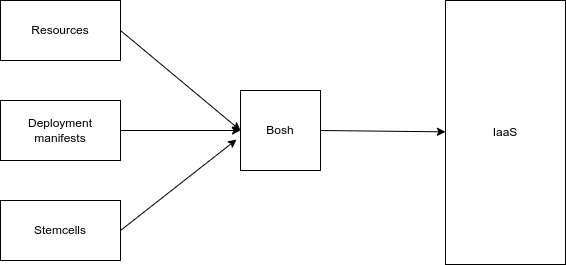

# LAB 4 - Understanding Bosh

## Bosh introduction

Bosh requires access to an IaaS
  
### Bosh does many things

- Provisions virtual machines in the cloud
- Installs and configure packages
- Starts services
- Monitor processes and VMs
- Provide capabilities both for developers and operators

### Desired state and actual state

The Bosh reconciliation loop

You tell Bosh the state you want your system to be in:

- what software to run
- operating system versions
- how many instances
- how much resource to allocate

Bosh attempts to makes it so, on a continuous basis.

### Bosh as a Black Box

Bosh takes inputs in the form of:

- Resources (software packages)
- Stemcells (base operating system images)
- Deployement manifests (descriptions of the overall system)

Bosh interacts with a cloud provider to provision VMs with the appropriate software.

### Deploying with Bosh

Deploying with Bosh (a three-step dance)

- Release - Upload the release to the Bosh Director
- Stemcell - Upload the stemcell needed by the release, if there is one
- Manifest - Deploy the manifest