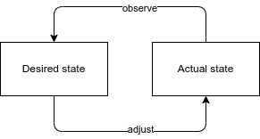

# LAB 4 - Understanding Bosh

## Bosh introduction

Bosh requires access to an IaaS
  
### Bosh does many things

- Provisions virtual machines in the cloud
- Installs and configure packages
- Starts services
- Monitor processes and VMs
- Provide capabilities both for developers and operators

### Desired state and actual state

The Bosh reconciliation loop

You tell Bosh the state you want your system to be in:

- what software to run
- operating system versions
- how many instances
- how much resource to allocate

Bosh attempts to makes it so, on a continuous basis.

### Bosh as a Black Box

Bosh takes inputs in the form of:

- Resources (software packages)
- Stemcells (base operating system images)
- Deployement manifests (descriptions of the overall system)

Bosh interacts with a cloud provider to provision VMs with the appropriate software.

### Deploying with Bosh

Deploying with Bosh (a three-step dance)

- Release - Upload the release to the Bosh Director
- Stemcell - Upload the stemcell needed by the release, if there is one
- Manifest - Deploy the manifest

### Release components

The main parts fo a Bosh software release are **jobs** and **packages**

#### Jobs

Jobs define what application components to run and how to build them.

They provide scripts for **monit** which will be used by Bosh to control how components are started, stopped and monitored.

Elements for jobs end up under `/var/vcap/jobs` on Bosh-managed VMs.

#### Packages

Packages provide source code and/or binary dependencies to jobs.

Some packages may have to be compiled before they can run.

Compilation happens as part of Bosh deployment.

Elements from packages end up under `/var/vacp/packages` on Bosh-managed VMs.

### Bosh stemcell

The base ingredient of Bosh VMs is an image that Bosh uses to create the VMs it manages:

- Includes core tools for Bosh to manage the VM (bosh-agent, monit, runit)
- Versioned for security updates
- Supports current Ubuntu and Windows operating systems
- Available for all major IaaS providers including AWS, Azure, GCP, OpenStack and VMware
- Published at [https://bosh.io/stemcells](https://bosh.io/stemcells)

### Deployment manifest

Telling Bosh what you want to be installed and run

### Cloud configuration

Making Bosh deployments cloud agnostic

The same manifest, unmodified, can be used to deploy the same distributed system to a different cloud.

Bosh abstracts away the differences between multiple clouds using a separate cloud-specific configuration.

Elements in the deployment map onto cloud-specific infrastructure elements.

